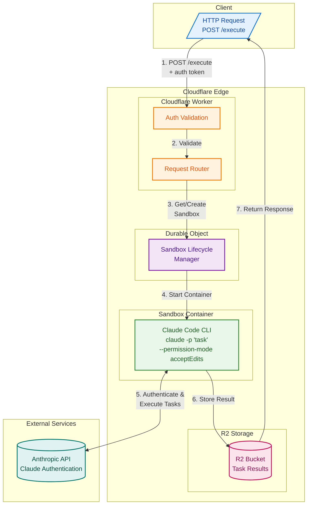
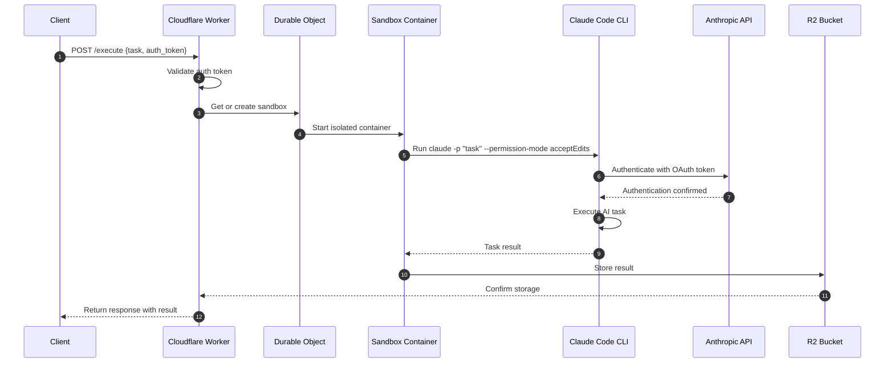

# Cloudflare Sandbox Architecture

Technical architecture diagram showing how Claude Code runs in Cloudflare Sandbox containers.

## System Architecture



## Request Flow Sequence



## Key Architecture Principles

### Isolation
Each task runs in its own isolated sandbox container, ensuring:
- Complete process isolation between tasks
- Clean environment for each execution
- No cross-contamination of state

### Security
Multiple layers of authentication and authorization:
- **API Auth Token**: Validates incoming requests at the Worker level
- **OAuth Token**: Claude Code authenticates with Anthropic API
- **Container Isolation**: Sandboxed execution environment

### Persistence
Results are durably stored for reliability:
- **R2 Bucket**: Task results stored for later retrieval
- **Durable Objects**: Manage sandbox lifecycle and state
- **Idempotent Operations**: Safe retry behavior

## Component Responsibilities

| Component | Responsibility |
|-----------|----------------|
| **Client** | Initiates requests with task definition and authentication |
| **Worker** | Entry point, auth validation, request routing |
| **Durable Object** | Manages sandbox lifecycle, ensures single instance per task |
| **Sandbox Container** | Isolated execution environment for Claude Code |
| **Claude Code CLI** | Executes AI tasks with controlled permissions |
| **R2 Bucket** | Persistent storage for task results |
| **Anthropic API** | Provides Claude AI capabilities via authenticated access |

## Data Flow Summary

```
Client Request
    |
    v
[Worker: Auth + Routing]
    |
    v
[Durable Object: Lifecycle]
    |
    v
[Sandbox: Isolated Container]
    |
    +---> [Claude Code] <---> [Anthropic API]
    |
    v
[R2: Store Results]
    |
    v
Response to Client
```
